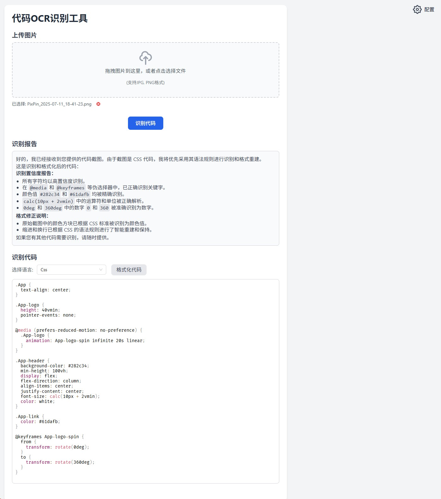

# 代码OCR识别工具

本项目是一个基于 React 的代码 OCR 识别工具，支持将代码截图或扫描件自动识别为可编辑文本，并智能格式化和高亮显示。支持多种编程语言，适用于开发者和技术文档处理场景。

## 主要功能

- **图片上传**：支持拖拽或选择本地图片（JPG/PNG），自动识别图片中的代码内容。
- **AI OCR识别**：集成 AI 接口，自动区分易混淆字符，智能还原代码格式与缩进。
- **多语言支持**：自动检测并高亮显示主流编程语言（如 JavaScript、Python、Java、C++ 等）。
- **代码编辑与格式化**：识别结果可直接编辑，并一键格式化代码。
- **识别报告**：附带置信度报告，展示混淆字符修正情况。
- **参数配置**：支持自定义 AI 接口地址、API Key、模型名称及提示词，可通过弹窗灵活配置。

## 页面截图



## Vercel 部署支持

本项目可无缝部署至 [Vercel](https://vercel.com/)，支持静态资源托管与前端自动化构建。只需将本仓库导入 Vercel，即可一键部署并在线访问。

- 推荐使用 Vercel 环境变量配置 API 地址和密钥。
- 部署后可通过 Vercel 提供的域名访问，无需额外服务器配置。

## 快速开始

1. 安装依赖：
   ```bash
   npm install
   ```
2. 启动开发环境：
   ```bash
   npm start
   ```
3. 构建生产环境：
   ```bash
   npm run build
   ```

## 参数简述

- **Base URL**：AI接口地址（如 https://api.example.com）
- **API Key**：用于鉴权的密钥
- **模型名称**：如 gpt-4-vision-preview
- **提示词**：支持 Markdown 格式，可自定义识别行为

## 目录结构

- `src/`：前端源码及组件
- `public/`：静态资源
- `.vercel/`：Vercel 部署相关配置

## License

MIT
